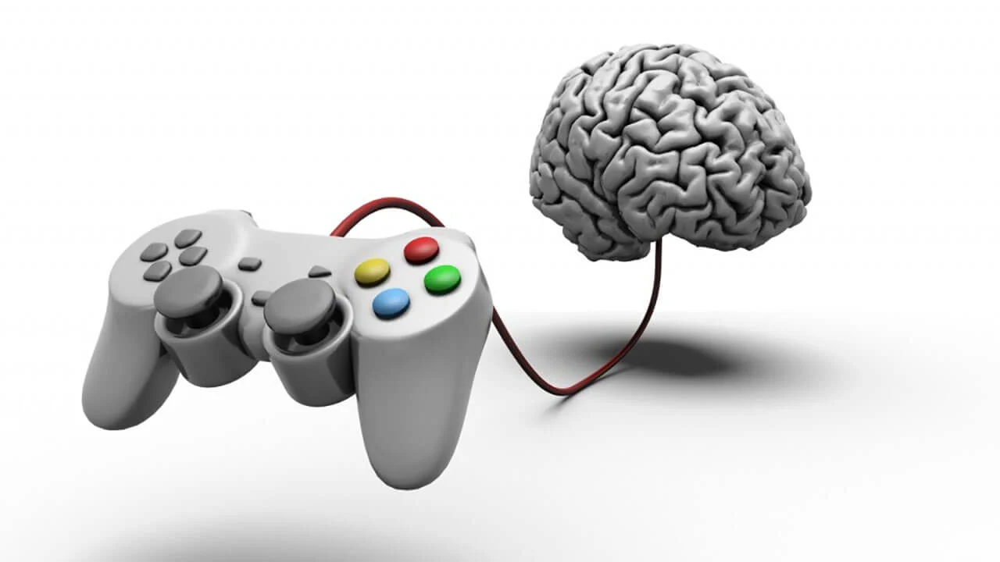

### Hexlet tests and linter status:
[](https://github.com/TeonaGZ/frontend-project-44/actions)
[](https://codeclimate.com/github/TeonaGZ/frontend-project-44/maintainability)


# "Brain games" 

It is a set of five console games for pumping the brain. Each game asks questions that need to be answered correctly. After three correct answers, the game is considered to be completed. Wrong answers end the game and offer to play it again. 

# Games:
1. Definition of an **even number**.
2. **Calculator.** Arithmetic expressions to be evaluated.
3. Finding the **Greatest Common Divisor**.
4. **Progression.** Search for missing numbers in a sequence of numbers.
5. Definition of a **prime number**.


## Installation
Download the repository and run the command in terminal: 
```
make install
```

### Install the package and run brain-even
[](https://asciinema.org/a/qAiSKfl2C07JJmPu8jH7MCBBd)

### Run brain-calc
[](https://asciinema.org/a/4FHZb2LQhMpMMdLtIkxxv7ZuY)

### Run brain-gcd
[](https://asciinema.org/a/kxKUs4yifg8PkFYQzTqhGLGzV)

### Run brain-progression
[](https://asciinema.org/a/it4jclpDXvD9IVX4GP4Qb06EO)

### Run brain-prime
[](https://asciinema.org/a/Ik7rYWBdjErigduEpmfTBjdcU)